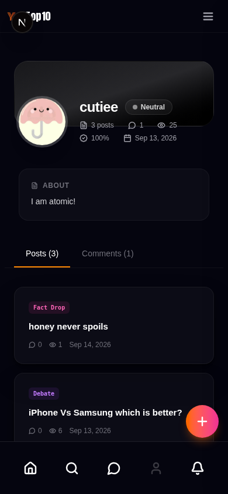

# YoTop10

> **Fact mine. Debate ground. Your list vs the world.**

[](https://github.com/nekwasar/yotop10/actions/workflows/ci.yml) [](https://github.com/nekwasar/yotop10/actions/workflows/cd.yml)

**[Live site](https://yotop10.com)** ·
**[Documentation](./docs/product_spec.md)** ·
**[Report a bug](https://github.com/nekwasar/yotop10/issues)** ·
**[Request a feature](https://github.com/nekwasar/yotop10/issues)**

YoTop10 is an open publishing platform for ranked lists — Wikipedia × Social Feed.
Anyone can browse, submit, and comment with no account and no login. Quality is
kept by admin curation, not by sign-up walls: every submission passes human
review before it goes live.

Similar to Reddit or Hacker News in spirit, but built around one question:
*what's your top 10?* Lists, head-to-head debates, and sourced fact drops —
ranked, challenged, and countered in the open.

## Screenshots

| Desktop | Mobile |
| ------- | ------ |
|  |  |

## Content types

| Type | Description | Example |
|---|---|---|
| **Top List** | Ranked items with written justification per item | "Top 10 Most Influential Scientists Ever" |
| **This vs That** | Two-item head-to-head with side voting | "iPhone vs Samsung — which is better?" |
| **Who Is Better** | Multi-candidate comparison | "Messi, Ronaldo, Pelé — Final Verdict" |
| **Best / Worst Of** | Time-scoped or inverse curated lists | "Best Movies of 2024" |
| **Hidden Gems** | Underrated topics | "10 Countries No One Talks About" |
| **Counter List** | A direct rival challenging an existing list | "My rebuttal to your Top 10 Rappers" |
| **Fact Drop** | Short sourced statement or discovery | "Honey never spoils" |
| **Article** | Long-form knowledge piece with sources | Deep dives with cover art and citations |

## Features

- **Publish** — submit lists, debates, facts, and articles with per-item images,
  source citations, categories (341 and counting), and autosaving drafts.
- **Debate** — side voting with live splits, counter-lists that challenge any
  ranking, argument threads with fire-weighted rebuttals.
- **Identity without accounts** — device identity with bot-resistant onboarding,
  trust tiers, and optional seed-phrase recovery. No passwords, no email.
- **Quality** — double-blind human review queue, AI-assisted pre-screening,
  title-collision detection, rate limits that scale with trust.
- **Profiles & discovery** — bios, link handles, full-text search with
  autocomplete, Hall of Fame, sitemaps and SEO throughout.
- **Admin** — review queues for posts and articles, moderation, user trust and
  restriction tools, audit logs, platform statistics.

## Built with

- [Next.js 15](https://nextjs.org/) — frontend (App Router, SSR)
- [Express](https://expressjs.com/) — API backend (TypeScript)
- [MongoDB 7](https://www.mongodb.com/) — primary data store
- [Redis 7](https://redis.io/) — cache, rate limits, sessions
- [Elasticsearch 8](https://www.elastic.co/) — full-text search
- [Docker Compose](https://docs.docker.com/compose/) — one-command self-hosting

## Self-host

```sh
cp .env.example .env   # fill in secrets (never commit .env)
docker compose up -d --build
```

The stack serves on port 80/443 (configure `NGINX_SERVER_NAME` and TLS
certificates via the provided nginx template). Moving an existing instance?
See [docs/db-restore.md](./docs/db-restore.md) — the whole database is a
single portable archive, and uploads merge newest-wins.

## Development

```sh
pnpm install --frozen-lockfile
pnpm dev:docker          # full stack with hot reload (recommended)
# or per package:
# (cd frontend && pnpm dev)   # Next.js on :3000
# (cd backend && pnpm dev)    # API on :8000
```

Every change must pass the gates before commit:

```sh
pnpm typecheck && pnpm lint && pnpm build && pnpm test
```

Start with [docs/product_spec.md](./docs/product_spec.md) (what the platform is),
[docs/rom.md](./docs/rom.md) (codebase audit and decisions), and
[AGENTS.md](./AGENTS.md) (mandatory workflow rules for contributors).

## Support & security

- Bugs and feature requests: [GitHub Issues](https://github.com/nekwasar/yotop10/issues).
- Security vulnerabilities: please report privately to the repository owner —
  do not open a public issue.

## License

© YoTop10. All rights reserved. Proprietary — no license is granted to use,
copy, modify, or distribute this software except as expressly agreed with the
owner.
